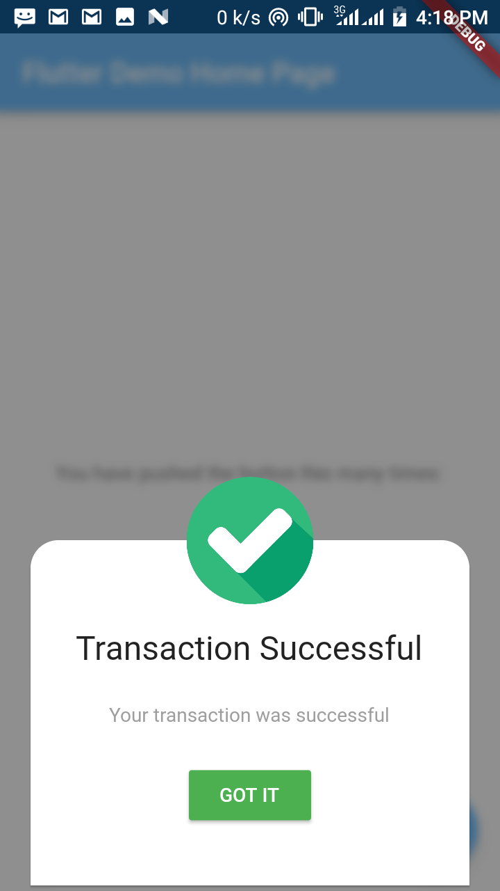
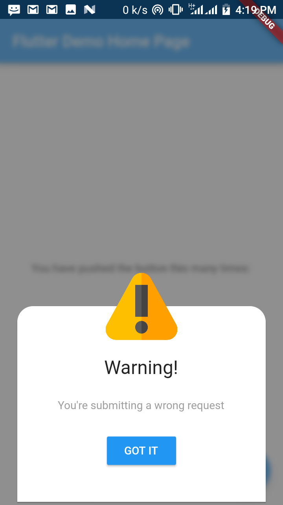

# rich_alert
An alert dialog package for the "rich". This package helps you to render an _un-traditional_ alert dialog in your Flutter app :smiley: 

# Support
This package supports usage on both Android and iOS builds.

## Adding to your flutter project
Add [`rich_alert`](https://pub.dartlang.org) as a dependency in your pubspec.yaml file
``` yaml
rich_alert: ^0.1.3
```

## Use the package
Import the library in your dart file
``` dart
import 'package:rich_alert/rich_alert.dart';
```

## Example
``` dart
showDialog(
  context: context,
  builder: (BuildContext context) {
    return RichAlertDialog( //uses the custom alert dialog
      alertTitle: richTitle("Alert title"),
      alertSubtitle: richSubtitle("Subtitle"),
      alertType: RichAlertType.WARNING,      
    );
  }
);
```
Check [examples](https://github.com/thedejifab/rich_flutter_dialog/tree/master/example)

## Screenshots
<p> </p>
